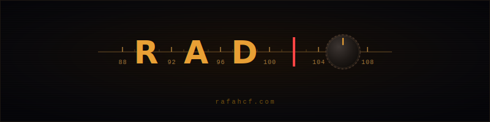

  

  An interactive radio-frequency experience built entirely in Dart.

  <a href="https://rafahcf.com"><strong>► rafahcf.com</strong></a>

---

### About

Radio is a single-page interactive experience that simulates tuning an analog FM radio. Audio is synthesised at runtime through the Web Audio API, every visual effect is pure CSS, and the project ships with zero JavaScript runtime dependencies.

The codebase is written entirely in Dart and compiled to static HTML, CSS, and JavaScript via the [Jaspr](https://docs.jaspr.site) framework, then deployed as a static site on GitHub Pages.

### How it works

| Layer        | Technology                                                   |
|--------------|--------------------------------------------------------------|
| Framework    | Jaspr (Dart → static HTML)                                   |
| Rendering    | Server-side generated, client-side hydrated                  |
| Audio        | Web Audio API via `dart:js_interop` (procedural synthesis)   |
| Visual FX    | Pure CSS (analog static, CRT scanlines, LCD aging)           |
| Interaction  | Pointer capture, touch, keyboard, wheel                      |
| Deploy       | GitHub Pages (static)                                        |

### Signals

  <code>87.5 · 91.3 · 95.7 · 99.1 · 103.5</code>

  Five frequencies. Tune in to find them.

---

  Built with Jaspr · Dart · CSS · Web Audio API

